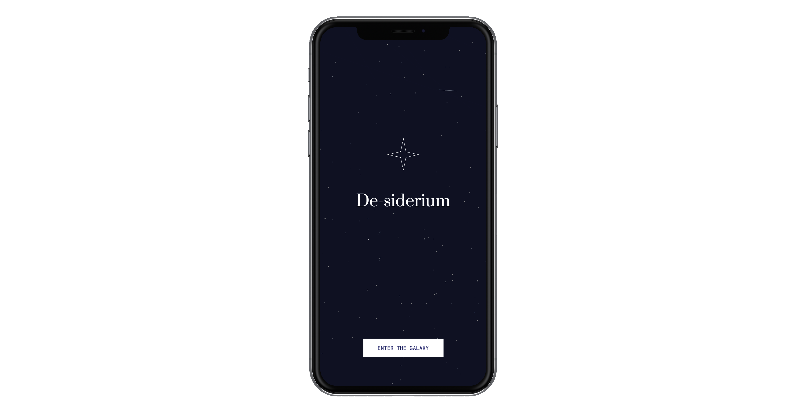

<p align="center">
  
</p>

### Table of Contents
0. [Introduction](#introduction) <br>
1. [Aim of the project](#aim-of-the-project) <br>
  1a. [Goals](#goals) <br>
  1b. [Context of use and device](#context-of-use-and-device) <br>
2. [Architecture](#architecture) <br>
  2a. [Main page](#main-page) <br>
  2b. [Welcome page](#welcome-page) <br>
  2c. ["Cards" page](#cards-page) <br>
  2d. [Chosen card page](#chosen-card-page) <br>
  2e. [Transitioning page](#transitioning-page) <br>
  2f. [Interactive experience](#interactive-experience) <br>
3. [Design challenges](#design-challenges) <br>
  3a. [Graphic aspects](#graphic-aspects) <br>
  3b. [Sound aspects](#sound-aspects) <br>
4. [Coding challenges](#coding-challenges) <br>
5. [References](#references) <br>
6. [Credits](#credits) <br>
7. [Video demo](#video-demo) <br>
8. [Team members](#team-members) <br>
9. [Course](#course) <br>

## Introduction
During last year everyone's wishes have been put on hold, therefore the concept is to wish everyone to success in the New Year and to achieve their desires and goals. The meaning is to create a brighter virtual “sky”, which represents 2021, since 2020’s sky wasn’t so bright.
The title “De-siderium” comes from a Latin term “de” + “siderum, a” that literally means desire/wishes, but it is also related to the idea of coming from the “stars”. Indeed the stars are a recurring element in the project. <br>

## Aim of the project
The aim of the project is to create a collaborative experience where people can make a wish. The project consists in a solo part in which the user can mentally express a wish and a collective part in which the users all together interact by drawing a constellation and see the others' ones. <br>

### Goals
The goal is to make people able to wish what they want to reach in 2021, giving a good omen and sense of hope. The tradition says that a wish will never come true if it will be said out loud. So the user has to define their desire and choose the category to which it refers. After the choice the user will read an inspirational message and can customize the star that appears on the screen. After the solo experience, at the end, people can interact by creating constellations in the part of the sky where their category name is placed. The will is to make people reflect about the sense of community that unifies us, focusing on the idea that the wishes usually expressed have something in common. <br>

### Context of use and device
The project is designed to be used every time someone wants to reflect on a personal achievement and wants to visualize it in a metaphorical way. To be more easily accessible and enjoyable the WebApp is developed for mobile devices. <br>

## Architecture
<p align="center">
  
</p>

### Main page
<p align="center">
  
</p>

The first interface that appears when a user accesses to the WebApp is made of: the title of the project, “De-siderium”, placed in the middle of the page; a star animation above the title; a generative background composed by a night sky and shooting stars; a button, in the lower part of the screen, which allows to enter the next page. <br>

### Welcome page
<p align="center">
  
</p>

In this page a "typewriter" message comes up explaining the main aspects about the project. A button, in the lower part of the screen, allows to enter the next page. <br>

### "Cards" page
<p align="center">
  
</p>

The twelve symbols here represent the common traits of the wishes. The desire expressed by the user won’t be written, but just symbolized by an icon, following the tradition of keeping secret your wish to make it come true. Each card is a button that allows to go ahead in the next step and the user has to choose just one of them. <br>

### Chosen card page
<p align="center">
  
</p>

 Each symbol of the previous page reveals a meaningful message for the user depending on the category chosen. In this page everyone can customize their own star by moving three sliders to change the number of points and the inner and outer radius. In the lower part of the screen there are three buttons: "BACK" allows to go back to the "Cards" page and re-choose another category, "SAVE" enables the download of a .png file of the customized card to always remind goals, "DONE" gives the access to the following page. <br>

### Transitioning page
<p align="center">
  
</p>

This is a page between the solo and the interactive experience: a five seconds countdown and a "tunnel of stars" lead the user to the final page.

### Interactive experience
<p float="left" align="center">
        
   
</p>

The interaction between users takes place in the last page, a virtual collective space in which people can simultaneously draw constellations in their specific category in white color. Users can also see others' creations in light blue. <br>

## Design challenges
<p align="center">
  
</p>

The design choices reflect a simple and essential mood to create a relaxing and meditative atmosphere that reminds a night sky. Moreover, the design is intuitive to create a clear user experience. <br>

### Graphic aspects
<p align="center">
  
</p>

The most used colors in the whole app are two shades of blue and white. The other colors are related to the twelve categories and they define the customized stars. The categories which have a similar meaning have different intensity of the same shade.

<p align="center">
  
</p>

There are two fonts that have different usages. "Prata", a serif elegant font, is used for the logo, for the all titles and for the meaningful messages. Instead "Roboto mono", a more simple sans serif font, defines all the secondary texts, such as buttons and instructions for the user. <br>

### Sound aspects
There are three kinds of sounds. The first one is a short sound effect for all the buttons; the second one is a higher pitched tone related to the categories icons; the third one is a contemplative track that plays in the last interface to create a more immersive and collective experience. <br>

## Coding challenges
One of the coding challenges was creating a "star function" connected with sliders that control the number of points and the inner and outer radius to customize the star.

```javascript
//nPointedStar customized with sliders
function nPointedStar(x, y, n, outerRadius, innerRadius) {
  let theta = TAU / n;
  beginShape();

  for (let i = 0; i < n; i++) {
    vertex(x + cos(i * theta) * outerRadius, y + sin(i * theta) * outerRadius);
    vertex(x + cos((i + 0.5) * theta) * innerRadius, y + sin((i + 0.5) * theta) * innerRadius);
  }

  endShape(CLOSE);
}
```
The most challenging part was to organize the structure of the message for the client. At first we could only make visible the point(data.x, data.y) to the client, but we eventually managed to show also the line(data.x, data.y, data.x2, data.y2) that creates the constellation by writing a double cycle message.

```javascript
//Interaction between users
function otherMouse(data) {
  console.log("received:", data);

  push();
  strokeWeight(4);
  stroke(93, 133, 213);
  point(data.x, data.y);
  pop();

  push();
  strokeWeight(0.5);
  stroke(93, 133, 213);
  line(data.x, data.y, data.x2, data.y2);
  pop();

}

function mouseClicked() {
  console.log("sending: ", currX, currY, prevX, prevY);

  currX = mouseX;
  currY = mouseY;

  push();
  strokeWeight(4);
  stroke(255);
  point(currX, currY);
  pop();

  strokeWeight(0.5);
  stroke(255);

  var message;

  if (prevX == -1) {
    line(currX, currY, currX, currY);

    let message = {
      x: currX,
      y: currY,
      x2: currX,
      y2: currY,
    };
  } else {
    line(currX, currY, prevX, prevY);

    let message = {
      x: currX,
      y: currY,
      x2: prevX,
      y2: prevY,
    };

    socket.emit("mouse", message);
  }

  prevX = currX;
  prevY = currY;

}
```

## References
[Co--Star Astrology App](https://www.costarastrology.com/) &
[Galaxy of covers](https://galaxy-of-covers.interactivethings.io/) -
The main inspirations for De-siderium, graphic-wise, were these two projects. <br>

## Credits
[P5js](https://p5js.org/) -
P5 JavaScript library was used to develop the WebApp. <br>

[P5.sound](https://p5js.org/reference/#/libraries/p5.sound) -
The p5.sound library allowed to add sound effects to the project. <br>

[Bensound](https://www.bensound.com/royalty-free-music/track/relaxing) -
Bensound is the source for the music used in the interactive part of the project. <br>

[Freesound](https://freesound.org/) -
Freesound is the source for the sound effects used for the buttons. <br>

[Google Fonts](https://fonts.google.com) -
Google Fonts is the source for the fonts used in the project. <br>

[Heroku](https://www.heroku.com/) -
Heroku is the cloud platform we used to publish the website, through GitHub. <br>

## Video demo
[Video demo](https://drive.google.com/file/d/13u6w05VsdSseEWKRtU0yNKFHseeW7-By/view?usp=sharing) -
Here you can find a demo of the use of the WebApp. <br>

## Team members
<p align="center">
  
</p>

## Course
[Creative Coding 2020/2021](https://drawwithcode.github.io/2020/) <br>
**Politecnico di Milano** - Scuola del Design - Communication Design <br>
**Faculty:** Michele Mauri, Andrea Benedetti, Tommaso Elli <br>
