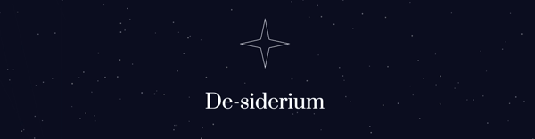
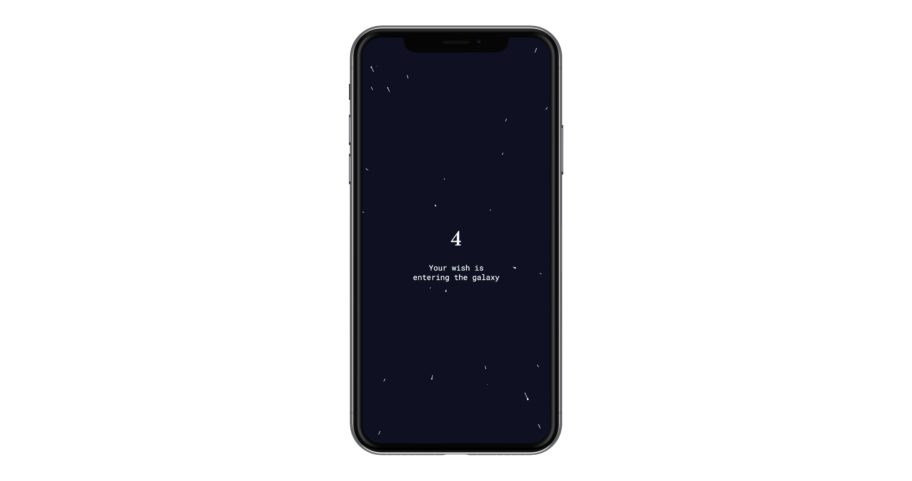

# node-and-p5
a simple project using node and p5.js, following this tutorial: https://thecodingtrain.com/Tutorials/12-websockets/

# how to run

Be sure to have node installed: https://nodejs.org/

* install node dependencies: `npm install`
* run local server: `node server.js`

  

### Table of Contents
0. [Introduction](#introduction)  
1. [Aim of the project](#aim-of-the-project)  
  1a. [Goals](#goals)  
  1b. [Context of use and device](#context-of-use-and-device)  
2. [Architecture](#architecture)  
  2a. [Main page](#main-page)  
  2b. [Welcome page](#welcome-page)  
  2c. [Cards](#cards)  
  2d. [Chosen card](#chosen-card)  
  2e. [Transitioning page](#transitioning-page)  
  2f. [Interactive experience](#interactive-experience)  
3. [Design challenges](#design-challenges)  
  3a. [Graphic aspects](#graphic-aspects)  
  3b. [Sound aspects](#sound-aspects)  
  3c. [Interaction](#interaction)  
4. [Coding challenges](#coding-challenges)  
5. [References](#references)  
6. [Credits](#credits)  
7. [Team members](#team-members)  
8. [Course](#course)  

## Introduction
2020 was an unfortunate year, therefore the concept is to wish everyone to success in the New Year and to achieve their desires and goals. The meaning is to create a brighter virtual “sky”, which represents the 2021, since 2020’s sky wasn’t so bright.
The title “De-siderium” comes from a Latin term “de” + “siderum,a”. It literally means desire/wishes, but it is also related to the “stars”.

KEYWORDS: TRACE, SHARING MULTI-SENSORY EXPERIENCE, NETWORK.  

## Aim of the project
The aim of the project is to create a collaborative experience where people can make a wish: each one will become a star and will be part of a bright sky. The desires will be metaphorically sent to the sky and the people can interact with other users by drawing a constellation and see the others one.  

### Goals
The goal is to make people able to wish what they want to reach in 2021, giving them a good omen and hope. The tradition says that a wish will never come true if it will be said out loud. So the users have to define their desires and define within one of the twelve categories proposed. After the choice the users will read an auspicious message related to their wishes and can customize the star that appears on the screen. At the end everyone will arrive in a sky full of stars where people can interact by creating constellations in the part of the sky where their category is placed. The will is to make people reflect about the sense of community that unifies us, focusing on the idea that the wishes generally expressed have something in common.  

### Context of use and device
The project is designed to be used every time someone reflects on a personal achievement and wants to visualize it in a metaphorical way. To be more easily accessible and enjoyable the app is developed for mobile devices.  

## Architecture

  

### Main page

  

The first interface that appears when a user access to the app is made from: the title of the project, “De-siderium”, placed in the middle of the page; a star’s animation, above the title; a generative background composed by a night sky and a shooting stars; a button, in the lower part of the screen, which allows to enter the next page.  

### Welcome page

  

### Cards

  

### Chosen card

  

### Transitioning page

  

### Interactive experience

  

## Design challenges

  

The design choice reflects a simple and essential mood to create a relaxing and meditative ambient that reminds a night sky. Moreover, the design is intuitive to create an easy user experience.  

### Graphic aspects

  

The most used colors in the whole app are two shades of blue and white. The other colors are related to the twelve categories and they define the customized stars. The categories which have a similar meaning have different intensity shades of the same color.

  

There are two fonts that has different usages. "Prata" is used for the logo, the all titles and the meaningful messages. "Roboto mono" instead defines all the others secondary texts, such as buttons and instructions for the user.  

### Sound aspects
There are three kinds of sounds. The first is a short sound effect for all the buttons; the second is a higher pitched tone related to the categories icons; the third is a contemplative track that plays in the last interface to create a more immersive and collective experience.  

### Interaction
The interaction between users takes place in the last page, a virtual collective space where people can simultaneously draw the constellations in their specific category in white color. The users can also see others creations in light blue.  

## Coding challenges

## References

## Credits

## Team members

  

## Course
[Creative Coding 2020/2021](https://drawwithcode.github.io/2020/)  
**Politecnico di Milano** - Scuola del Design - Communication Design  
**Faculty:** Michele Mauri, Andrea Benedetti, Tommaso Elli  
